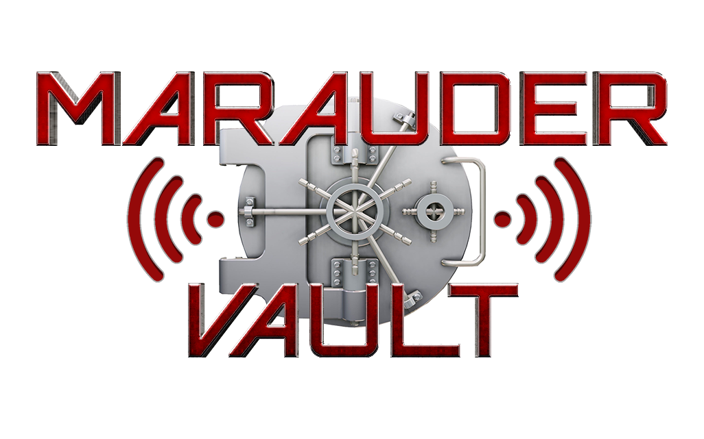

 
<b>A place to find Marauder boot screens, icons and color tweaks!</b>

 

<b>Below you can find links to some great resources that have been put together by the great members of the marauder community!
A big thank you to each of you in this awesome community. None of this would be possible if it weren't for you and your awesomeness!</b>

 

## What is Wifi-Marauder?
It is a suite of WiFi/Bluetooth offensive and defensive tools for the ESP32. You can read more about Wifi-Marauder on the <a href="https://github.com/djsime1/awesome-flipperzero">about page</a>.

## Wifi-Marauder Links.
* [`The creator and genius behinde Wifi Marauder.](https://github.com/justcallmekoko/ESP32Marauder)
* [`A wonderful Wiki for anything Marauder related.](https://github.com/justcallmekoko/ESP32Marauder/wiki)
* [`Checkout some sweet build for sale by JustCallMeKoko.](https://www.tindie.com/stores/justcallmekoko/)

  

  

